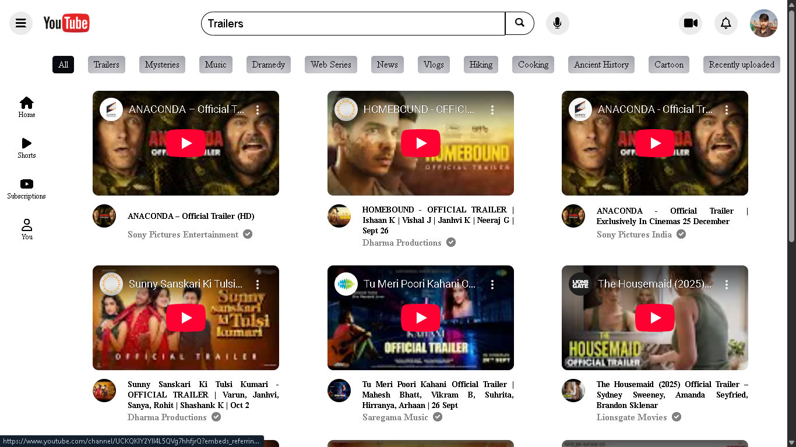

# YouTube-Clone Project

## 🚀 Overview
The **YouTube Clone** replicates core video streaming features, including search, playback, and browsing. It integrates YouTube API to fetch real-time videos based on search queries. Designed with a responsive interface, it ensures smooth navigation, efficient performance, and an intuitive user experience across devices, closely resembling YouTube’s functionality.

---

## 🛠 Tech Stack
### **Frontend**
- HTML
- CSS
- JavaScript

---

## ✨ Features
### Frontend
- Responsive UI with modern design
- Google API integration for real-time updates
- Search Videos
- Additional Keywords for Searching Query.

---

## 📂 Project Structure
```
project-root/
│
├── frontend/       # Frontend code (React)
└── README.md     # This file
```

---

## 🚀 Deployment
- **Frontend:** Deployed on Netlify

---

The project is live!  
👉 **[View Live Demo](https://youtube-clone2026.netlify.app/)**

---
---

## 📸 Screenshots


---

## 📞 Contact
- **Author:** Suraj Nishad
- **Email:** iamsuraj0737@gmail.com
